# Clase 1 – Introducción a Containers y Docker

## Objetivo

Desplegar diferentes contenedores Docker utilizando imágenes oficiales (Apache, Redis, MySQL), verificar su funcionamiento, revisar logs, acceder a cada servicio y finalmente eliminarlos.  
El propósito es comprender el ciclo completo de administración de contenedores.

---
# Desarrollo

---
# 1. Contenedor Apache (httpd)

## 1.1. Ejecutar el contenedor Apache

`docker run -d --name mi-apache -p 8081:80 httpd`

### Explicación del comando

| Parámetro          | Descripción                                             |
| ------------------ | ------------------------------------------------------- |
| `docker run`       | Crea y ejecuta un nuevo contenedor.                     |
| `-d`               | Lo ejecuta en segundo plano (detached).                 |
| `--name mi-apache` | Asigna un nombre personalizado al contenedor.           |
| `-p 8081:80`       | Mapea el puerto local 8080 al puerto 80 del contenedor. |
| `httpd`            | Imagen oficial de Apache HTTP Server.                   |
**Screenshot:**
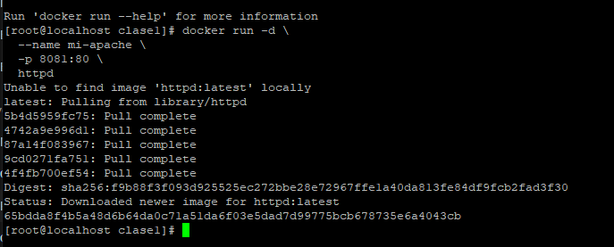

---
## 1.2. Verificar contenedor Apache

`docker ps`

**Screenshot:**
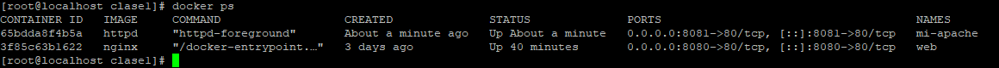

---
## 1.3. Acceder desde el navegador

Ingresé en:

`http://192.168.29.134:8081`

**Screenshot:**
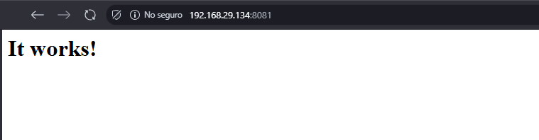

---
## 1.4. Ver logs del contenedor Apache

`docker logs mi-apache`

**Screenshot:**
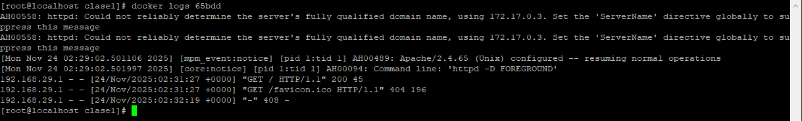

---

## 1.5. Detener y eliminar contenedor Apache

`docker stop mi-apache docker rm mi-apache`

**Screenshot:**
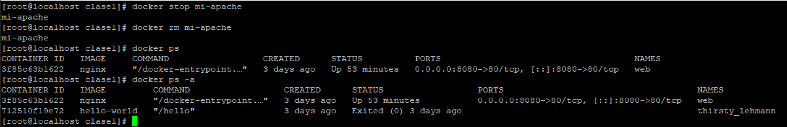

---

---

# 2. Contenedor Redis

## 2.1. Ejecutar el contenedor Redis

`docker run -d --name mi-redis -p 6379:6379 redis`

### Explicación del comando

|Parámetro|Descripción|
|---|---|
|`docker run`|Crea y ejecuta el contenedor.|
|`-d`|Ejecuta en segundo plano.|
|`--name mi-redis`|Nombre del contenedor.|
|`-p 6379:6379`|Expone el puerto de Redis al host.|
|`redis`|Imagen oficial del servidor Redis.|
**Screenshot:**
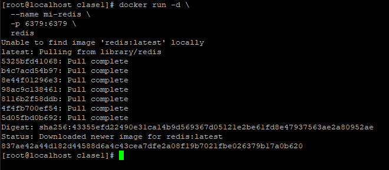

---

## 2.2. Verificar contenedor Redis

`docker ps`

**Screenshot:**
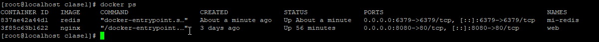

---

## 2.3. Probar conexión a Redis

`docker exec -it mi-redis redis-cli`

**Screenshot:**
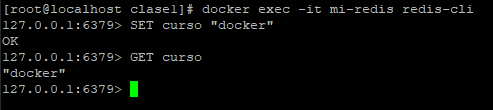

---

## 2.4. Revisar logs de Redis

`docker logs mi-redis`

**Screenshot:**
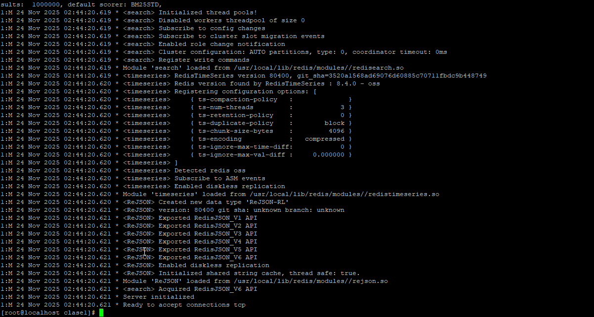

---

## 2.5. Detener y eliminar contenedor Redis

`docker stop mi-redis docker rm mi-redis`

**Screenshot:**
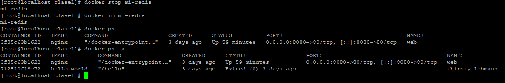

---

---

# 3. Contenedor MySQL

## 3.1. Ejecutar el contenedor MySQL

`docker run -d \   --name mi-mysql \   -p 3306:3306 \   -e MYSQL_ROOT_PASSWORD=mi-password-seguro \   mysql`

### Explicación del comando

| Parámetro                 | Descripción                                            |
| ------------------------- | ------------------------------------------------------ |
| `-d`                      | Ejecuta en modo detached.                              |
| `--name mi-mysql`         | Nombre del contenedor.                                 |
| `-p 3306:3306`            | Expone el puerto MySQL al host.                        |
| `-e MYSQL_ROOT_PASSWORD=` | Crea variable de entorno: contraseña del usuario root. |
| `mysql`                   | Imagen oficial de MySQL.                               |
**Screenshot:**
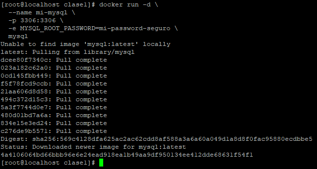

---

## 3.2. Verificar contenedor MySQL

`docker ps`

**Screenshot:**
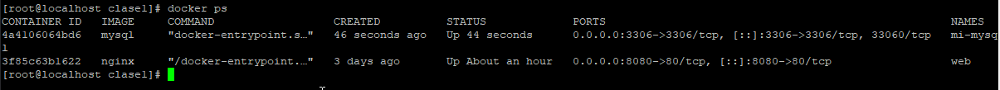

---

## 3.3. Conectarse al servidor MySQL

`docker exec -it mi-mysql mysql -uroot -p`

**Screenshot:**
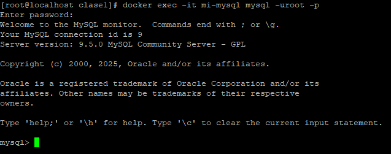

---

## 3.4. Revisar logs de MySQL

`docker logs mi-mysql`

**Screenshot:**
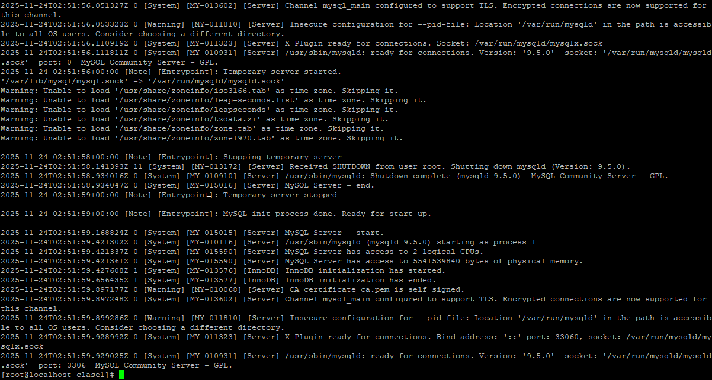

---

## 3.5. Detener y eliminar contenedor MySQL

`docker stop mi-mysql docker rm mi-mysql`

**Screenshot:**
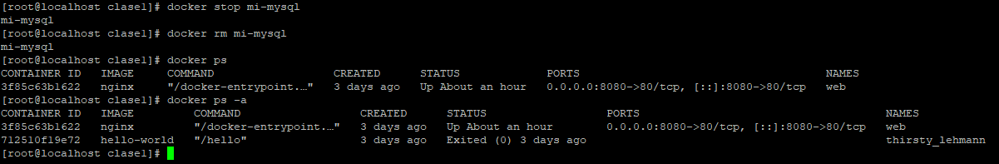

---

# Conclusiones

- Aprendí a gestionar todo el ciclo de vida de un contenedor en Docker: crear, ejecutar, verificar, acceder, revisar logs y eliminar.
    
- Comprendí cómo funcionan los mapeos de puertos y la importancia del flag `-d`.
    
- Practiqué la conexión interactiva a Redis y MySQL mediante `docker exec`.
    
- Documenté el proceso usando Markdown, comandos, explicaciones y screenshots como se solicitó.