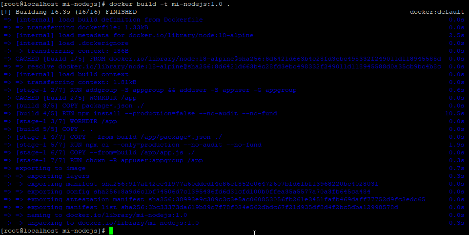
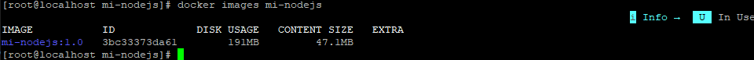
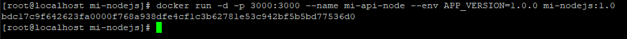
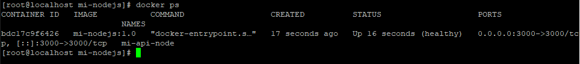
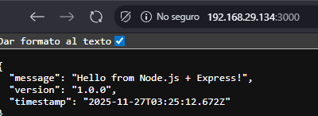
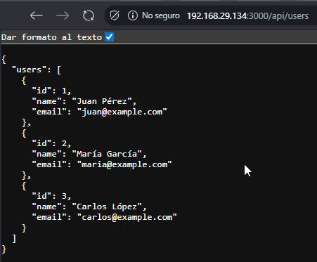
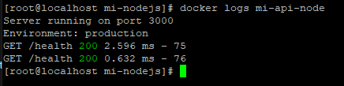
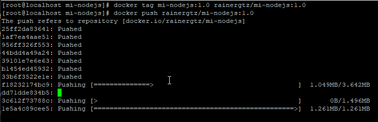
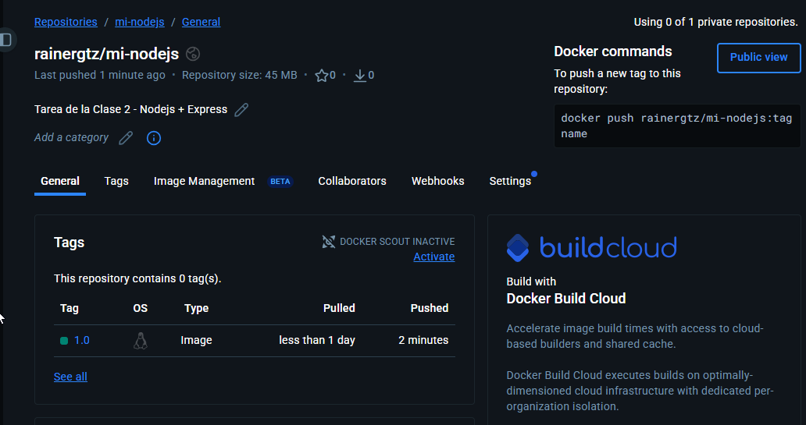

# Clase 2 – Dockerización de Aplicación Node.js con Multi-Stage Build

## 1. Descripción de la Aplicación

**Lenguaje:** Node.js  
**Framework:** Express  
**Entorno:** AlmaLinux 9.6 + Docker Engine

Esta es una pequeña API REST creada para fines de práctica en la clase 2, con endpoints básicos para manejar datos de usuarios de ejemplo.

### **Funcionalidad Principal**

La aplicación expone endpoints simples que permiten:

- Ver una página de bienvenida
    
- Listar usuarios
    
- Obtener un usuario por ID
    
### **Endpoints Disponibles**

|Método|Endpoint|Descripción|
|---|---|---|
|GET|`/`|Página de bienvenida de la API|
|GET|`/api/users`|Lista de usuarios|
|GET|`/api/users/:id`|Obtiene un usuario según ID|

---
## 2. Dockerfile

### **Código completo**

`# ============================ # Stage 1: Builder # ============================ FROM node:18-alpine AS builder  WORKDIR /app  COPY package*.json ./ RUN npm install  COPY . .  # ============================ # Stage 2: Production # ============================ FROM node:18-alpine  WORKDIR /app  COPY --from=builder /app ./  EXPOSE 3000 CMD [ "node", "app.js" ]`
**Codigo:**
[Dockerfile](mi-nodejs/Dockerfile)
---

### **Explicación de Cada Stage**

|Stage|Propósito|Explicación|
|---|---|---|
|**builder**|Instalar dependencias|Aquí se descargan e instalan todos los paquetes necesarios. Se copian los archivos fuente.|
|**production**|Imagen final optimizada|Solo contiene lo esencial para ejecutar la app, copiando desde el builder. Reduce el tamaño y mejora seguridad.|

---

### **Tabla de Instrucciones del Dockerfile**

|Instrucción|Función|
|---|---|
|`FROM`|Define la imagen base|
|`WORKDIR`|Carpeta de trabajo dentro del contenedor|
|`COPY`|Copia archivos desde el host|
|`RUN`|Ejecuta comandos en la imagen|
|`EXPOSE`|Documenta el puerto que usará la app|
|`CMD`|Comando por defecto al iniciar|
## 3. app.js

**Codigo:**
[app.js](mi-nodejs/app.js)
---
## 4. package.json

**Codigo:**
[package.json](mi-nodejs/package.json)
---
## 5. .dockerignore

**Codigo:**
[.dockerignore](mi-nodejs/.dockerignore)

---

## 6. Proceso de Build

Comando utilizado:

`docker build -t mi-nodejs:1.0 .`
**Screenshot:**

### **Tamaño final de la imagen**

`docker images mi-nodejs`
**Screenshot:**

---

## 7. Testing Local

### **Ejecutar el contenedor**

`docker run -d -p 3000:3000 --name mi-node mi-nodejs-app:1.0`
**Screenshot:**

---

### Screenshots requeridos

#### **docker images**

#### **docker ps**

#### **Probando en el navegador**
**Screenshot:**

#### **Probando endpoint de usuarios**
**Screenshot:**

#### **docker logs**
**Screenshot:**

---

## 8. Publicación en Docker Hub

### **Tag y Push a Docker Hub**

`docker tag mi-nodejs-app:1.0 miusuario/mi-nodejs-app:1.0`
**Screenshot:**

### **URL Pública**

`https://hub.docker.com/r/miusuario/mi-nodejs-app`

### **Screenshot de Docker Hub**

---

### **Optimizaciones realizadas**

- Uso de **multi-stage build**
    
- Instalación de dependencias en un stage separado
    
- Reducción de capas
    
- Imagen base **node:18-alpine** (más ligera)
    
- Copia solo de archivos necesarios
    
- Eliminación de `node_modules` locales (gracias al builder)
    

---

### **Capas de la imagen (docker history)**

`docker history mi-nodejs:1.0`

---

## 9. Conclusiones

Durante esta práctica se aprendió a:

- Crear una aplicación Node.js simple con Express
    
- Dockerizarla correctamente
    
- Aplicar un **multi-stage build**
    
- Optimizar el tamaño de la imagen
    
- Publicar una imagen en Docker Hub
    
- Ejecutar y probar correctamente la API en un contenedor
    

### **Diferencias con Clase 1**

- Clase 1: solo imágenes simples (Apache, Redis, MySQL)
    
- Clase 2: se crea una **aplicación real**, se dockeriza, se optimiza y se publica.