**Curso:** Docker & Kubernetes - Clase 3  (Dcoker Compose) 
**Estudiante:** Rainer Huber Gutierrez Pabón GTZ  
## Descripción Pequeña aplicación multi-contenedor que demuestra Docker Compose, redes personalizadas y persistencia con volúmenes. Stack: `nginx` (web estático), `mysql` (BD) y `adminer` (GUI de BD).    
## Stack 
- App: Nginx (static HTML) 
- Base de datos: MySQL 8.0 
- GUI: Adminer 
- Orquestación: Docker Compose (v2) 
- Red: `app-network` 
- Volumen: `db-data` (persistencia MySQL)  
## Estructura del repositorio``

/curso-docker-kubernetes-tareas/clase3/  
├── README.md  
├── docker-compose.yml  
├── .gitignore  
├── html/  
│ └── index.html  
└── initdb/  
└── init.sql

## Requisitos 
- Docker (daemon corriendo) 
- Docker Compose (v2; comando `docker compose`)  
	## Ejecución (desde la raíz del repositorio) 
	1. Clonar:    ```bash    git clone https://github.com/Rainer-gtz/curso-docker-kubernetes-tareas/tree/main/clase3    
	2. cd curso-docker-kubernetes-tareas/clase3/``

2. Levantar los servicios (modo detached):
    
    `docker compose up -d`
    
3. Verificar que se levantaron:
    
    `docker compose ps`
    
4. Acceder:
    
    - Web: [http://localhost:8080](http://localhost:8080)
        
    - Adminer: [http://localhost:8081](http://localhost:8081)
        
        - Sistema: MySQL
            
        - Server: curso_mysql — nombre del servicio
            
        - Usuario: curso
            
        - Contraseña: curso123
            
        - Database: curso_db
            

## Verificaciones importantes (comandos)

- Servicios corriendo:
    
    `docker compose ps`
    
- Ver volúmenes:
    
    `docker volume ls`
    
- Inspeccionar red:
    
    `docker network ls 
    `docker network inspect clase3_app-network`
    
- Probar persistencia:
    
    `docker compose down 
    `docker compose up -d 
    `docker compose exec mysql mysql -u curso -pcurso123 -D curso_db -e "SELECT * FROM productos;"`
    

> **Importante:** No se debe usar `docker compose down -v` si se desea conservar los datos.

# Capturas de Pantalla – Tarea Clase 3

Este apartado contiene todas las capturas de pantalla generadas durante la ejecución de la Tarea 3 — Aplicación Multi-Contenedor con Docker Compose.

---

## 1 Estado general de los servicios

### **docker-compose ps**

Muestra que los servicios `curso_nginx`, `curso_mysql` y `curso_adminer` están en ejecución.
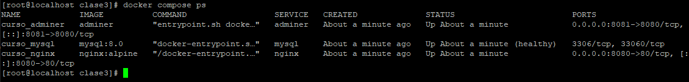
---

## 2 Archivo docker-compose.yml funcionando

### **docker compose up -d**

Demuestra el levantamiento correcto de todos los servicios.
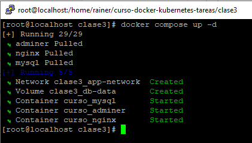
---

## 3 Red personalizada creada

### **docker network ls**

Lista las redes y confirma la existencia de `clase3-app-network`.
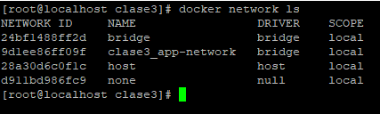
---

## 4 Inspección de la red custom

### **docker network inspect clase3-app-network**

Muestra los contenedores conectados y sus direcciones IP.
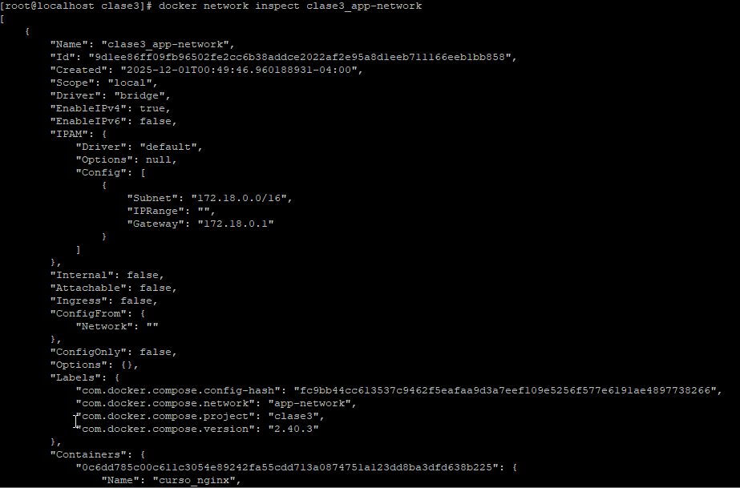
---

## 5 Volumen persistente

### **docker volume ls**

Confirma que el volumen named `mysql_data` (o el que uses) fue creado correctamente.
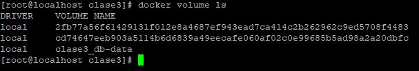
---

## 6 Página web funcionando (Nginx)

### **Acceso vía navegador**

Demuestra que el servicio web es accesible desde [http://localhost:8080](http://localhost:8080) (o tu puerto configurado).
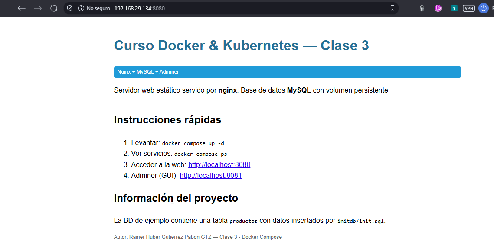
---

## 7 Interacción vía Docker Exec

### **docker compose exec**

Evidencia de ingreso a contenedores para pruebas internas, validando la persistencia posterior a realizar docker compose down y docker compose up.
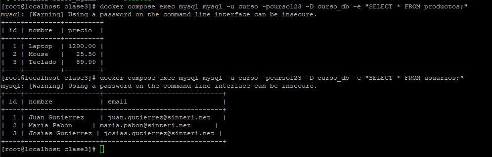
---

## 8 Prueba de persistencia

### **docker compose down / up -d**

Muestra que al bajar y subir de nuevo, los servicios continúan funcionando y la base de datos mantiene los datos.

### docker compose down
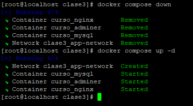
---

## 9 Conexión entre servicios (Ping / DNS interno)

### **Validación de comunicación entre contenedores**

Demuestra que los servicios se encuentran en la misma red y resuelven sus nombres vía DNS.
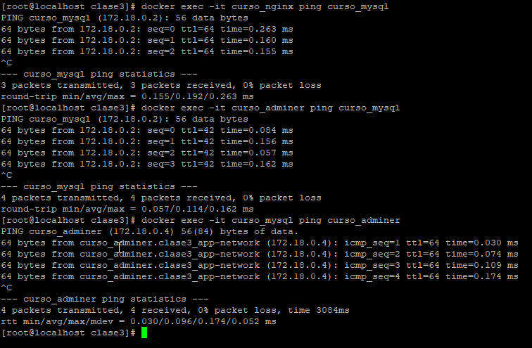
---

## 10 Adminer — Pantalla de Login

### **Login inicial**

Evidencia de acceso al cliente Adminer.
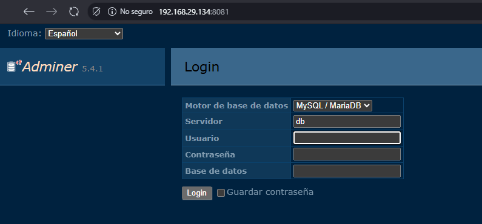
---

## 11 Adminer — Conexión con la Base de Datos

### **Datos de conexión completados**

Muestra el formulario con host, usuario, contraseña y base de datos.
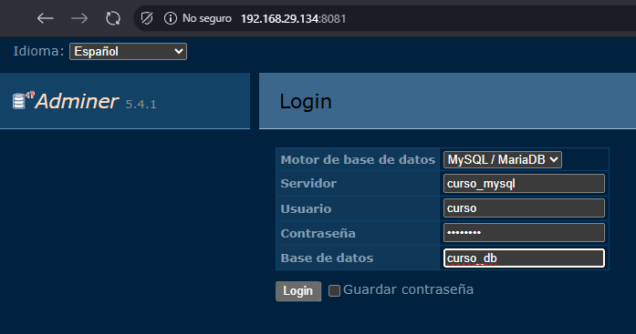
---

## 12 Adminer — Contenido de MySQL

### **Bases de datos visibles**

Vista del contenido dentro del servidor MySQL.
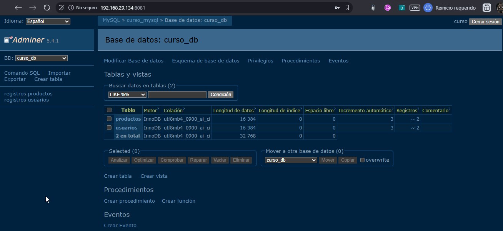
---

## 13 Adminer — Usuarios de la Base de Datos

### **Usuarios configurados en MySQL**

Demuestra la correcta creación del usuario definido por variables de entorno.
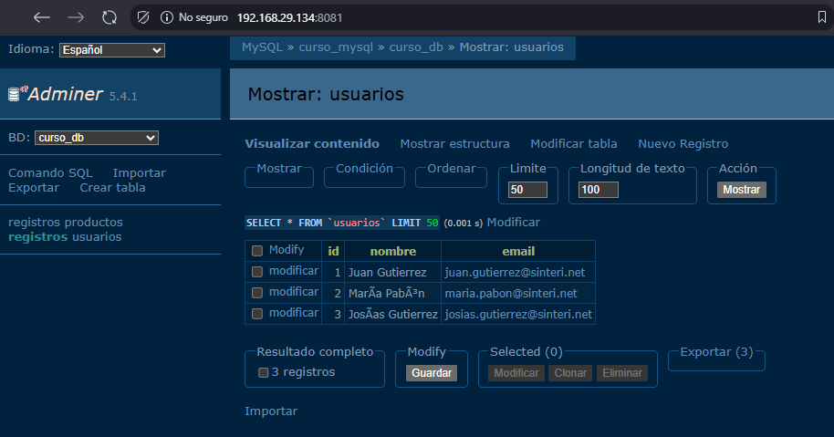