# E-commerce con Microservicios, Redis Cache, MongoDB y Gateway Nginx

### Proyecto – Clase 4 (Docker & Microservicios)

Este proyecto implementa una arquitectura moderna basada en microservicios para un e-commerce básico, usando:

- **Nginx** como _API Gateway_    
- **Frontend estático (HTML/CSS/JS)**    
- **Products Service** (Node.js + Express + MongoDB + Redis Cache)    
- **Cart Service** (Node.js + Express + MongoDB)    
- **Redis** para cacheo de productos    
- **MongoDB 7.0** para persistencia    
- **Docker Compose** con redes, volúmenes y dependencias    

---
## Arquitectura General
        ┌────────────────┐
        │    Frontend    │
        └───────▲────────┘
                │
                ▼
       ┌───────────────────┐
       │   Nginx Gateway    │  ← puerto 8080
       └─────┬─────────┬───┘
             │         │
     /api/products   /api/cart
             │         │
     ┌──────────┐   ┌─────────┐
     │Products   │   │ Cart     │
     │Service    │   │ Service  │
     └─────┬─────┘   └────▲────┘
           │              │
       Cache Redis     MongoDB
           │              │
           └──────┬──────┘
                  ▼
             Persistencia

---
## Estructura del Repositorio
docker-microservicios-clase4/
├── docker-compose.yml
├── .gitignore
├── gateway/
│   └── nginx.conf
├── products-service/
│   ├── Dockerfile
│   ├── package.json
│   └── server.js
├── cart-service/
│   ├── Dockerfile
│   ├── package.json
│   └── server.js
├── frontend/
│   ├── Dockerfile
│   └── index.html
├── docs/
│   └── screenshots/
└── README.md

---
## Ejecución del Proyecto

### 1. Construir y levantar los servicios

`docker compose up -d --build`

### 2. Ver logs por servicio

`docker compose logs -f gateway docker compose logs -f products docker compose logs -f cart`

### 3. Probar que el gateway responde

`curl http://localhost:8080/gateway/health`

### 4. Probar endpoints principales

#### Obtener productos (lista)

`curl http://localhost:8080/api/products`

#### Crear un producto

`curl -X POST http://localhost:8080/api/products \   -H "Content-Type: application/json" \   -d '{"name":"Teclado","price":25.00,"stock":50}'`

#### Ver el carrito

`curl http://localhost:8080/api/cart`

---
## Descripción de los Servicios

### 1. **Gateway (Nginx)**

- Expone el puerto **8080**.    
- Redirige `/` al frontend.    
- Redirige `/api/products` al Products Service.    
- Redirige `/api/cart` al Cart Service.    

---
### 2. **Products Service (Node.js + MongoDB + Redis)**

Incluye:

- **GET /api/products** → Lista con cache Redis    
- **GET /api/products/:id** → Cache por ID    
- **POST /api/products** → Invalida cache    
- **GET /api/health** → Health del servicio
    
Variables de entorno:

`PORT=5001 MONGO_URI=mongodb://mongo:27017/appdb REDIS_HOST=redis REDIS_PORT=6379 CACHE_TTL_SECONDS=60`

---
### 3. **Cart Service (Node.js + MongoDB)**

Incluye:

- **GET /api/cart**    
- **POST /api/cart/add**
    
Variables:

`PORT=5002 MONGO_URI=mongodb://mongo:27017/appdb`

---
### 4. **Redis**

- Usado para cachear productos.    
- Configurado con `appendonly yes`.
    
---
### 5. **MongoDB**

- Base: `appdb`    
- Usar **MongoDB 7.0** para evitar errores de compatibilidad con Mongoose 8.x.

---
## Evidencias / Screenshots

> Las capturas siguientes documentan el despliegue, pruebas y comportamiento del sistema (gateway, servicios, cache y persistencia).

---

### 1) Levantar servicios
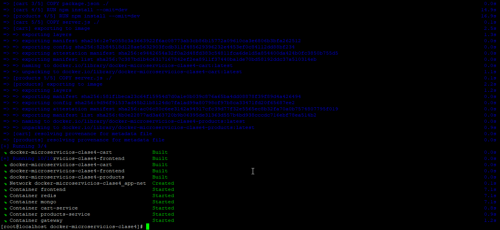
**Descripción:** Salida del comando `docker compose up -d --build` mostrando la fase de *build* y creación de recursos (imágenes/containers). Evidencia de que las imágenes de los servicios fueron construidas correctamente.

---
### 2) Verificar estado
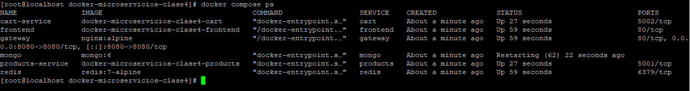
**Descripción:** Salida de `docker compose ps` (o `docker ps`) listando los contenedores activos del proyecto: `gateway`, `products-service`, `cart-service`, `redis` y `mongo`. Sirve para verificar que todos los servicios están “Up”.

---
### 3) Ver logs
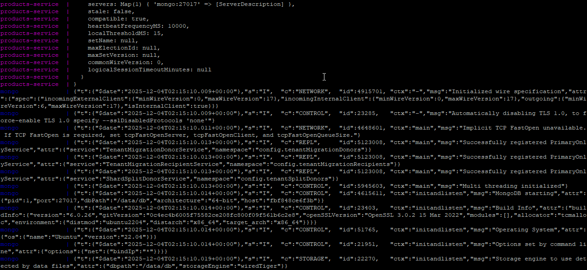
**Descripción:** Logs agregados (`docker compose logs -f`) mostrando arranque de servicios y mensajes clave (conexión a MongoDB, conexión a Redis, mensajes de health y mensajes de cache HIT/MISS). Útil para auditoría y debugging.

---
### 4) Acceder a la aplicación
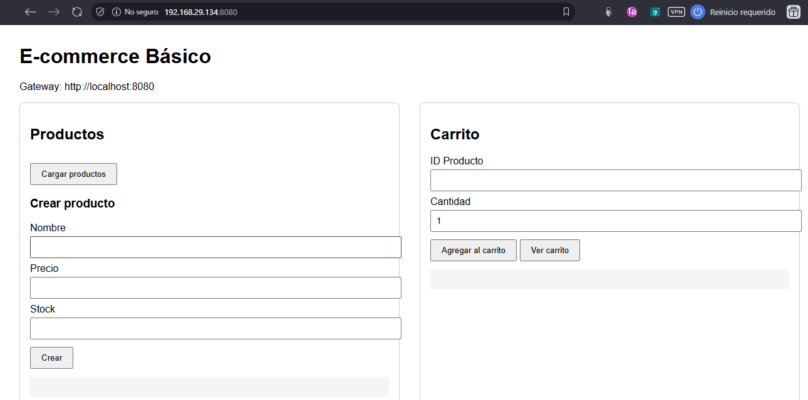
**Descripción:** Captura del navegador mostrando la interfaz web estática servida por el frontend a través del gateway (http://localhost:8080). Muestra los controles UI para listar productos, crear producto y gestionar carrito.

---
### 5) Acceder a la aplicación /api/health
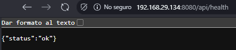
**Descripción:** Resultado del health check del gateway o del endpoint de health (`http://localhost:8080/gateway/health` o `http://localhost:8080/api/health`). Confirma que el gateway y/o los servicios responden correctamente.

---
### 6) Acceder a la aplicación /gateway/health
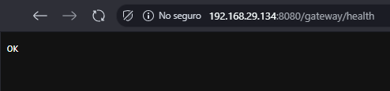
**Descripción:** Otra captura del health endpoint del gateway (puede mostrar texto simple `OK` o `Gateway OK`). Evidencia de que el Nginx gateway está operativo.

---
### 7) Endpoints de la API - Productos desde la BD
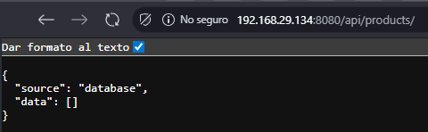
**Descripción:** Respuesta del endpoint `/api/products` cuando los datos fueron servidos desde la **base de datos** (Cache MISS). Muestra `source: "database"` y el payload con productos.

---
### 8) Endpoints de la API - Productos desde cache
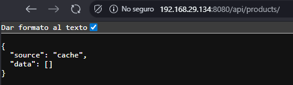
**Descripción:** Respuesta del endpoint `/api/products` cuando los datos fueron servidos desde **Redis** (Cache HIT). Muestra `source: "cache"` y la lista de productos — evidencia del funcionamiento del patrón Cache-Aside.

---
### 9) Endpoints de la API - Productos desde la BD & cache
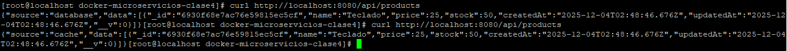
**Descripción:** Conjunto de `curl` mostrando la secuencia de pruebas: primer `curl` (Cache MISS → database) y segundo `curl` (Cache HIT → cache). Ideal para capturar logs y tiempos de respuesta comparativos.

---
### 10) Curl api-products
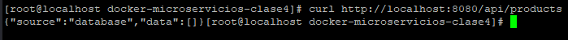
**Descripción:** Captura de un `curl` a `http://localhost:8080/api/products` mostrando la respuesta JSON y metadatos básicos. Generalmente usada para documentar formato de respuesta.

---
### 11) Crear nuevo producto
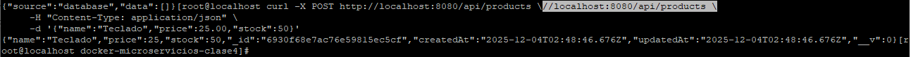
**Descripción:** Prueba `curl -X POST /api/products` que crea un nuevo producto. Muestra el request y la respuesta (objeto creado) y es la evidencia usada para demostrar invalidación de cache.

---
### 12) Persistencia de datos docker-compose-down
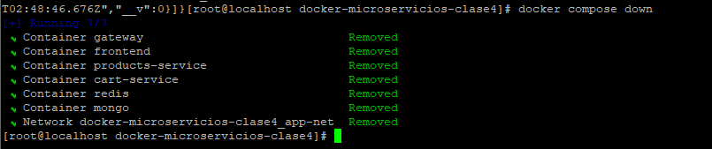
**Descripción:** Salida del comando `docker compose down` (posiblemente con `-v` si se limpian volúmenes). Evidencia del cierre controlado del entorno y liberación de recursos.

---
### 13) Persistencia de datos docker-compose-up-d
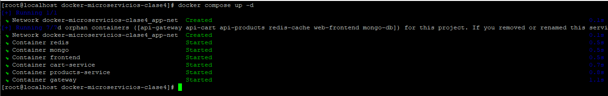
**Descripción:** Resultado de `docker compose up -d` con contenedores iniciados en segundo plano. Muestra tiempo de creación y mensaje de éxito al levantar el stack.

---

### 14) Curl api-products - Verificando persistencia.png
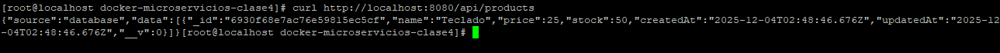
**Descripción:** Prueba de persistencia: después de crear datos y ejecutar `docker compose down` seguido de `docker compose up -d`, este `curl` demuestra que los productos creados permanecen en la base de datos (persistencia en `mongo-data`).

---
