# Docker-Seguridad-clase5#

#Estudiante: Rainer Huber Gutierrez Pabón GTZ

Nueva aplicación Node.js + MongoDB optimizada en seguridad y tamaño de imagen.

---
## Descripción
Esta aplicación es un backend completo en **Node.js 18** con endpoints REST para productos y un endpoint de health check `/health`. La base de datos es **MongoDB 6**.  
El objetivo principal es cumplir la **Tarea 5, Opción B**, aplicando **seguridad y optimización** en Docker: multi-stage build, Alpine, usuario non-root, healthcheck, labels, escaneo con Trivy y documentación de resultados.

---
## Tecnologías
- **Node.js 18** (Alpine)
- **MongoDB 6**
- **Docker & Docker Compose**
- **Trivy** (análisis de vulnerabilidades)
- **Express**, **Mongoose**, **Morgan**, **CORS**

---
## Estructura del repositorio
docker-seguridad-clase5/  
├── README.md  
├── Dockerfile # Optimizado (final)  
├── Dockerfile.baseline # Imagen inicial sin optimización  
├── docker-compose.yml  
├── .dockerignore  
├── package.json  
├── src/  
│ ├── server.js  
│ └── seed.js  
├── docs/  
│ └── screenshots/  
│ ├── trivy-baseline.png  
│ ├── trivy-optimizado.png  
│ ├── docker-images.png  
│ ├── docker-ps-healthy.png  
│ ├── whoami-nonroot.png  
│ ├── curl-endpoints-products.png  
│ ├── curl-localhost-health.png  
│ ├── curl-x-post-products.png  
│ └── datos-de-prueba-insertados.png  
└── scans/  
├── baseline-scan.json  
└── optimizado-scan.json


---

## Endpoints disponibles

| Método | Endpoint           | Descripción                  |
|--------|------------------|------------------------------|
| GET    | /products         | Listar todos los productos  |
| POST   | /products         | Crear un nuevo producto     |
| GET    | /health           | Health check del backend    |

**Opcional**: ejecutar `npm run seed` para insertar datos iniciales.

---
## Línea base (antes de optimizar)

**Dockerfile.baseline**: imagen sin optimización.

- Construcción:
```bash
docker build -f Dockerfile.baseline -t mi-app:baseline .

- Tamaño de imagen:   

`mi-app:baseline 1.6GB`

- Usuario dentro del contenedor:    

`docker run --rm mi-app:baseline whoami # root`

- Escaneo Trivy:    

`trivy image mi-app:baseline trivy image --severity CRITICAL,HIGH mi-app:baseline trivy image -f json -o scans/baseline-scan.json mi-app:baseline`

- Capturas:
    
    - `trivy-image-miapp-baseline.png` — Escaneo de vulnerabilidades de la imagen baseline
        
    - `trivy-image-several-high-critical-miapp-baseline.png` — Detalle de HIGH y CRITICAL
        

---

```

## Optimización aplicada

Se implementaron las siguientes mejoras en el **Dockerfile final**:

- **Multi-stage build**: reduce tamaño de imagen final copiando solo lo necesario.    
- **Alpine**: imagen ligera y segura.    
- **Usuario non-root** (`appuser`, UID 1001)    
- **Healthcheck**: verifica que el endpoint `/health` responde correctamente.    
- **Labels**: metadatos de seguridad, versión y mantenedor.    
- **.dockerignore**: excluye archivos innecesarios (node_modules, docs, scans).    

---
## Post-optimización

- Construcción de la imagen optimizada:    

`docker build -t mi-app:optimizado .`

- Tamaño de imagen:    

`mi-app:optimizado 221MB`

- Usuario dentro del contenedor:    

`docker run --rm mi-app:optimizado whoami # appuser`

- Escaneo Trivy:    

`trivy image --severity CRITICAL,HIGH mi-app:optimizado trivy image -f json -o scans/optimizado-scan.json mi-app:optimizado`

---
## Comparativa de imágenes

|Métrica|Baseline|Optimizado|Mejora|
|---|---|---|---|
|Tamaño imagen|1.6GB|221MB|-86%|
|Usuario|root|appuser|✓|
|Vulnerabilidades CRITICAL|0|0|✓|
|Vulnerabilidades HIGH|2|2|✓|
|Multi-stage build|✗|✓|✓|
|Health check|✗|✓|✓|

---
## Capturas de endpoints y pruebas funcionales

- **Consulta productos existentes**    
- **Health check local**    
- **Creación de producto**    
- **Datos de prueba insertados**
    

---
## Instrucciones de uso

`# Levantar servicios
docker compose up -d

`# Verificar health
curl http://localhost:3000/health

`# Verificar usuario non-root
docker exec mi-app-backend whoami

`# Sembrar datos de prueba (opcional)
docker exec mi-app-backend npm run seed

`# Listar productos
curl http://localhost:3000/products

`# Crear producto
curl -X POST http://localhost:3000/products \
     -H "Content-Type: application/json" \
     -d '{"name":"Mouse","price":15.5}'


---
## Screenshots

### 1) Construir baseline
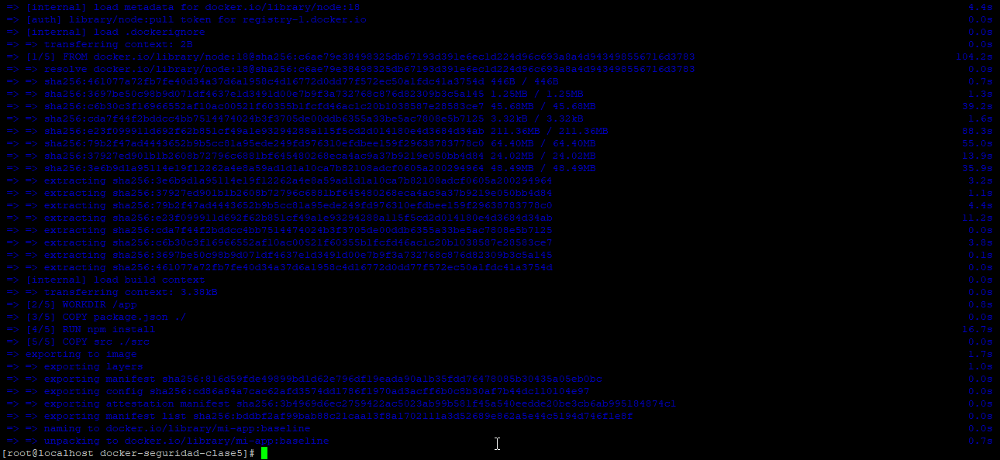
**Descripción:** Construcción de la imagen baseline usando el Dockerfile inicial, sin optimización. Evidencia del tamaño y capas de la imagen inicial.

---
### 2) Medir tamaño baseline
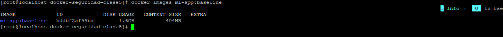
**Descripción:** Listado de la imagen baseline: tamaño mayor, ejecutándose como root. Muestra el estado inicial antes de optimización.

---
### 3) Ver usuario en ejecución - baseline
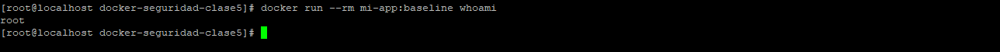
**Descripción:** Verificación del usuario en ejecución para la imagen baseline: se ejecuta como root. Comprobación de seguridad inicial.

---
### 4) Escaneo Trivy - baseline
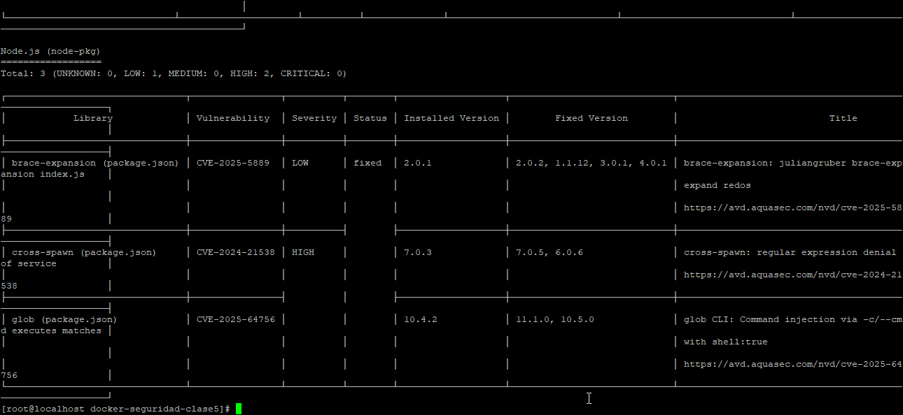
**Descripción:** Escaneo Trivy de la imagen baseline mostrando vulnerabilidades detectadas antes de optimizar. Evidencia de riesgos iniciales.

---
### 5) Escaneo Trivy - baseline several-high-critical
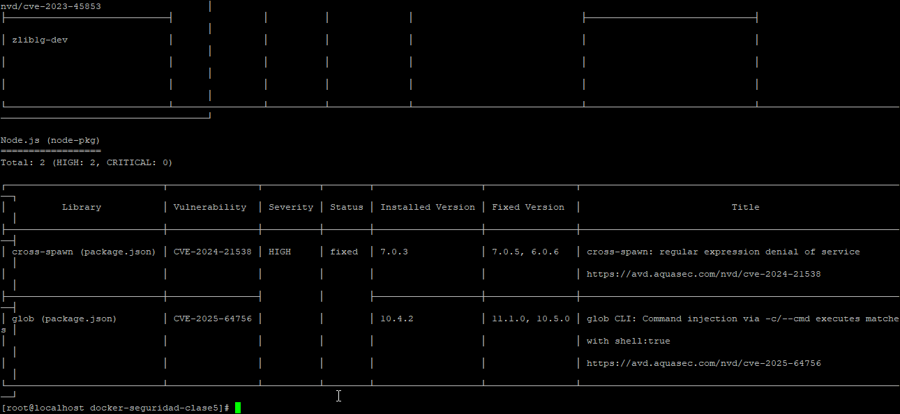
**Descripción:** Detalle de vulnerabilidades CRITICAL y HIGH en la imagen baseline. Evidencia que motivó la optimización de la imagen.

---
### 6) Construir imagen optimizada
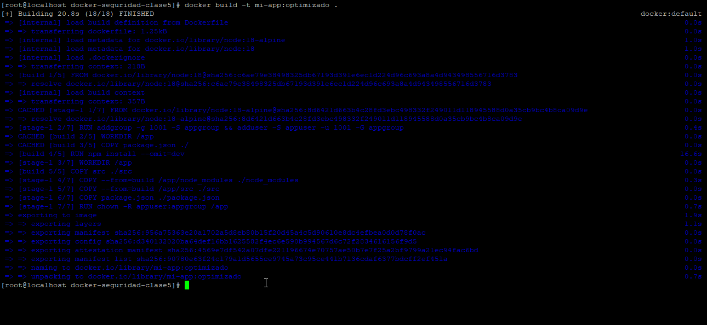
**Descripción:** Construcción de la imagen optimizada con multi-stage, Alpine y usuario non-root. Muestra la reducción de tamaño y mejoras en seguridad.

---
### 7) Medir tamaño - optimizado
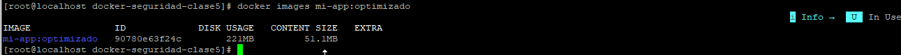
**Descripción:** Listado de la imagen optimizada: reducción de tamaño y capas. Evidencia de que la optimización se aplicó correctamente.

---
### 8) Escaneo Trivy optimizado
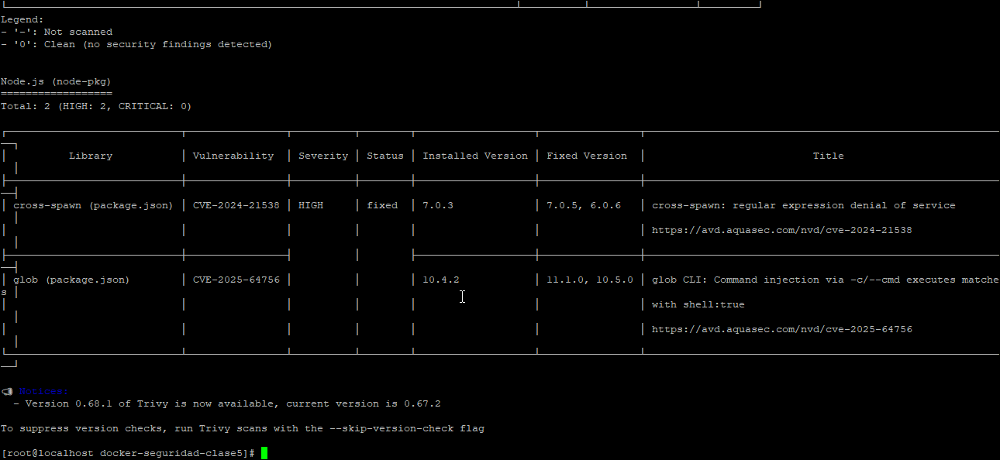
**Descripción:** Escaneo Trivy de la imagen optimizada, mostrando reducción de vulnerabilidades tras aplicar mejoras. Evidencia de mitigación de riesgos.

---
**Verificación de funcionalidad**
### 9) Levantar con docker-compose
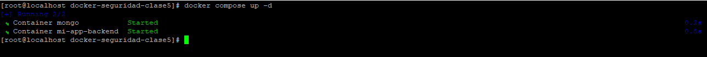
**Descripción:** Servicios levantados con docker-compose, incluyendo backend Node.js y MongoDB. Evidencia que los contenedores están corriendo correctamente.

---
### 10) Health
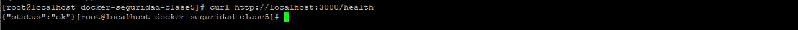
**Descripción:** Prueba GET `/health` para verificar que el backend responde correctamente (healthcheck). Muestra `OK` o mensaje de disponibilidad.

---
### 11) Ver usuario non-root
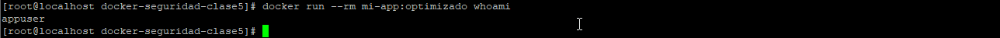
**Descripción:** Verificación del usuario en ejecución para la imagen optimizada: se ejecuta como appuser (non-root). Mejora de seguridad aplicada.

---
### 12) Sembrar datos
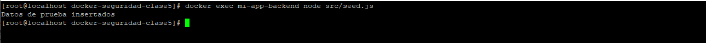
**Descripción:** Resultado del script seed.js mostrando que los datos de prueba se insertaron correctamente en la base de datos.

---
### 13) Probar endpoints - products
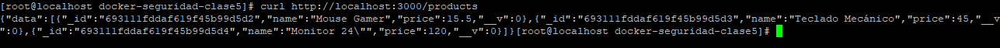
**Descripción:** Prueba GET `/products` para listar los productos existentes en la base de datos. Evidencia del correcto funcionamiento del endpoint.

---
### 14) Probar endpoints
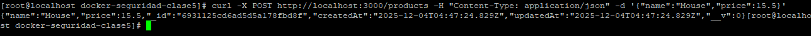
**Descripción:** Prueba POST `/products` para crear un nuevo producto en la base de datos. Evidencia de que la API acepta datos correctamente.

---
